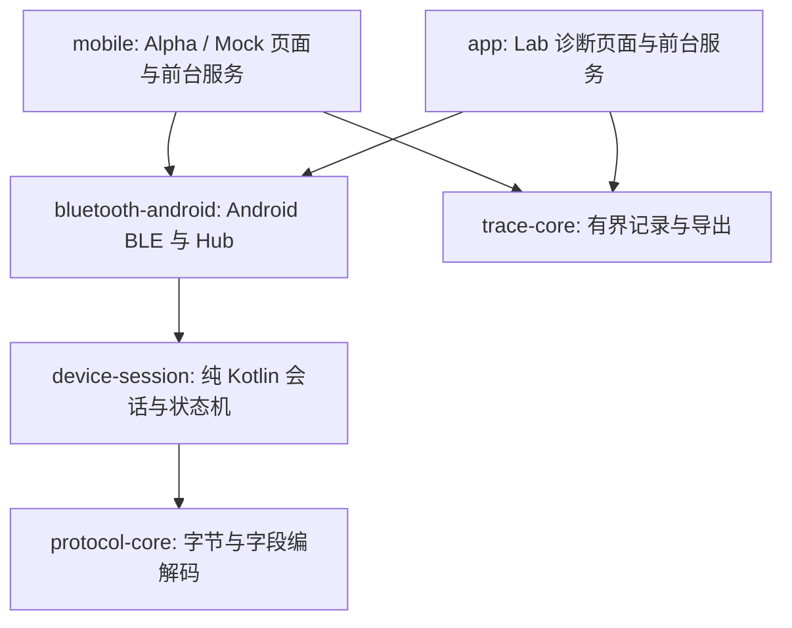

# 当前原生架构

此文描述当前实现，不把模块迁移当作整套业务协调器已经完成。

| 层 | 当前职责 | 不负责 |
|---|---|---|
| `protocol-core` | HOYI/BOOKOO字段、整数单位、XOR、固定命令和已支持参数范围 | 扫描、UI、发送重试、回报是否证明操作完成 |
| `device-session` | 串行队列、连接代次、认证与初始化、实际发送前检查、萃取启停/去皮/重量保护、四类机器写入确认状态机、预热状态/决策和被动萃取识别 | Android回调、偏好存储、文件选择器、页面文案 |
| `bluetooth-android` | Android GATT回调与主线程调度、扫描、权限检查；Hub组装会话和萃取控制器，统一秤去皮记录 | 弹出密码框、系统权限请求UI、持久化机器写入安全记录 |
| `mobile` | 页面和图表、曲线选择/报文证明、本地历史、前台服务、密码加密保存、安全恢复持久化；服务把真实回报送入共享状态机 | 原始蓝牙字节编解码、通用任意opcode发送 |
| `app` | Lab诊断、采集、显式操作及日志展示 | Alpha的全部产品恢复与交互协调规则 |
| `trace-core` | 有界异步JSONL记录、轮转、统计与导出 | 以日志落盘推断设备执行结果 |

## 写入确认状态机的归属

`SettingsWriteTracker`、`CupResetTracker`、`SleepNowTracker`、`SleepScheduleWriteTracker` 已从 `mobile` 移入 `device-session`，生产方法体与17项原测试方法体保持不变，JVM测试也迁入同一模块。它们区分写入中、等待回报、已确认、失败、未知和重新回读，不能把GATT成功直接当设备执行成功。

`StandaloneTare` 同属共享模块，实际实例由Hub管理；独立去皮及萃取控制器去皮使用同一记录。四类机器写入tracker实例目前仍由Mobile服务持有，服务维护通知序号、超时调度以及同步持久化的未确认标记。移动类定义不会自动把这些运行时职责转交Hub。

## 预热与被动萃取

`BrewPreparation` 与 `PassiveShotDetector` 也已迁入 `device-session`，两类生产方法体及8项原测试方法体保持不变。前者区分传输成功、温度就绪、取消已写入及未知；后者只根据机器帧发出识别事件，不发送控制命令。共享模块运行预热最终发送许可、被动记录时间顺序及预热门禁的JUnit测试。`BrewPreparation.permitsWrite` 由产品层传入Hub/会话的实际发送前检查，绑定本次请求号、目标温度及阶段，防止取消后旧排队预热继续发送。

`PreheatGate` 接收协议设置、当前补偿温度、曲线ID/目标温度、预热状态或取消上下文，返回结构化的启动/取消拒绝原因；没有产品曲线目录、中文文案或Android依赖。启动决策保留工作室模式、匹配的已就绪预热和±1°C温度要求；取消决策保留未结束萃取阻止、咖啡机READY、新鲜清醒待机与1.5秒边界。它不发送命令，也不替代固件许可、设置新鲜度、持久恢复标记和最终出队检查。

产品层 `StudioStartGate` 把产品曲线映射到共享预热输入并将拒绝原因转为页面文案，`BrewWaitCancelGate` 同样只适配共享取消判断与中文文案；`MobileService` 仍负责发送预热/取消、采样序号、被动历史记录、超时和跨进程安全持久化。Mock复用同一预热状态机，但不能作为真实加热行为证据。

## 仍需推进的边界

- 预热发送与曲线选择协调、被动萃取历史、历史和持久恢复仍在产品层；不能因此称所有业务已剥离。
- Lab与Alpha共享协议、会话与BLE，但产品门禁并不完全相同。
- 新控制功能必须同时具有旧版字节证据、参数限制、发送前复核、未知结果处理和相应机器验收；已有状态机迁移不扩大控制许可。
- 用户当前不提供测试设备；目标重量停止、设置生效与故障恢复的硬件行为仍未完成验收。
