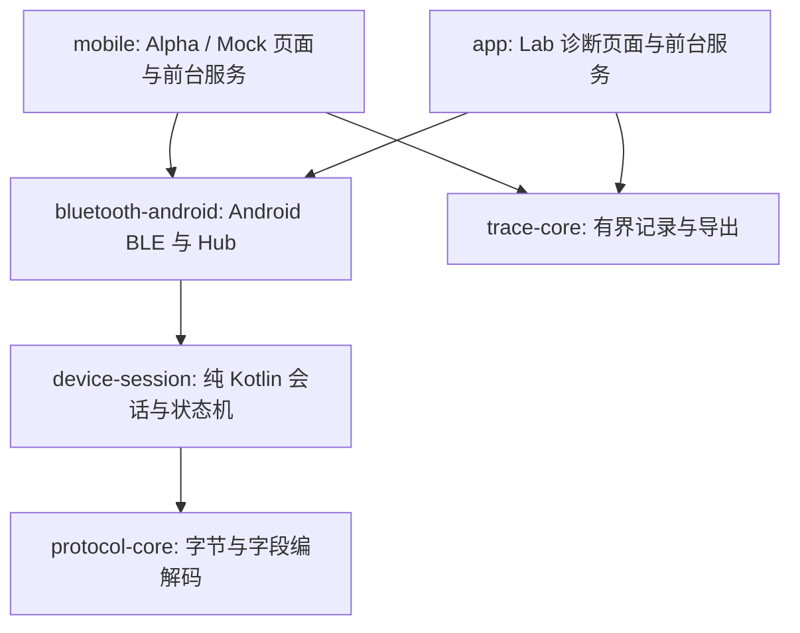

# 当前原生架构

此文描述当前实现，不把模块迁移当作整套业务协调器已经完成。

| 层 | 当前职责 | 不负责 |
|---|---|---|
| `protocol-core` | HOYI/BOOKOO字段、整数单位、XOR、固定命令和已支持参数范围 | 扫描、UI、发送重试、回报是否证明操作完成 |
| `device-session` | 串行队列、连接代次、认证与初始化、实际发送前检查、萃取启停/去皮/重量保护、四类机器写入确认状态机、预热状态/决策、被动萃取识别和安全恢复状态 | Android回调、偏好存储、文件选择器、页面文案 |
| `bluetooth-android` | Android GATT回调与主线程调度、扫描、权限检查；Hub组装会话和萃取控制器，统一秤去皮记录 | 弹出密码框、系统权限请求UI、持久化机器写入安全记录 |
| `mobile` | 页面和图表、曲线选择/报文证明、本地历史、前台服务、密码加密保存、安全恢复持久化；服务把真实回报送入共享状态机 | 原始蓝牙字节编解码、通用任意opcode发送 |
| `app` | Lab诊断、采集、显式操作及日志展示 | Alpha的全部产品恢复与交互协调规则 |
| `trace-core` | 有界异步JSONL记录、轮转、统计与导出 | 以日志落盘推断设备执行结果 |

`ShotSafetyPolicy` 同属纯会话层，只把当前萃取/连接状态分类为结果未知且断线、结果未知、正在萃取时断线或无此提醒。未知结果在重连后仍需核对。它没有发送、状态变更、持久化或恢复解除能力；Alpha首页与前台服务通过 `ShotSafetyAlert` 把同一原因映射成当前Context的显示资源，通知路由根据原因是否存在判断。提醒文字不提供停机许可，也不能证明机器已停水。

## 写入确认状态机的归属

`SettingsWriteTracker`、`CupResetTracker`、`SleepNowTracker`、`SleepScheduleWriteTracker` 已从 `mobile` 移入 `device-session`，迁移时生产方法体与17项原测试方法体保持不变，JVM测试也迁入同一模块。它们区分写入中、等待回报、已确认、失败、未知和重新回读，不能把GATT成功直接当设备执行成功。

`StandaloneTare` 同属共享模块，实际实例由Hub管理；独立去皮及萃取控制器去皮使用同一记录。四类机器写入tracker实例目前仍由Mobile服务持有，服务维护通知序号、超时调度以及同步持久化的未确认标记。移动类定义不会自动把这些运行时职责转交Hub。

## 预热与被动萃取

`BrewPreparation` 与 `PassiveShotDetector` 也已迁入 `device-session`，两类生产方法体及8项原测试方法体保持不变。前者区分传输成功、温度就绪、取消已写入及未知；后者只根据机器帧发出识别事件，不发送控制命令。共享模块运行预热最终发送许可、被动记录时间顺序及预热门禁的JUnit测试。`BrewPreparation.permitsWrite` 由产品层传入Hub/会话的实际发送前检查，绑定本次请求号、目标温度及阶段，防止取消后旧排队预热继续发送。

`PreheatGate` 接收协议设置、当前补偿温度、曲线ID/目标温度、预热状态或取消上下文，返回结构化的启动/取消拒绝原因；没有产品曲线目录、中文文案或Android依赖。启动决策保留工作室模式、匹配的已就绪预热和±1°C温度要求；取消决策保留未结束萃取阻止、咖啡机READY、新鲜清醒待机与1.5秒边界。它不发送命令，也不替代固件许可、设置新鲜度、持久恢复标记和最终出队检查。

产品层 `StudioStartGate` 把产品曲线映射到共享预热输入并将拒绝原因转为页面文案，`BrewWaitCancelGate` 同样只适配共享取消判断与中文文案；`MobileService` 仍负责发送预热/取消、采样序号、被动历史记录、超时和跨进程安全持久化。Mock复用同一预热状态机，但不能作为真实加热行为证据。

## 仍需推进的边界

- 预热发送与曲线选择协调、被动萃取历史、历史和持久恢复仍在产品层；不能因此称所有业务已剥离。
- Lab与Alpha共享协议、会话与BLE，但产品门禁并不完全相同。
- 新控制功能必须同时具有旧版字节证据、参数限制、发送前复核、未知结果处理和相应机器验收；已有状态机迁移不扩大控制许可。
- 用户当前不提供测试设备；目标重量停止、设置生效与故障恢复的硬件行为仍未完成验收。

## 告警控制规则

`CoffeeAlarmPolicy` 是纯Kotlin的16位告警决策：只忽略bit14/C16尾水预警，返回按旧版优先级排列的首个阻止位；未知bit15阻止新控制。Mobile负责中文告警描述和时效显示，页面启动与banner调用共享规则；DeviceSession的原新鲜待机门禁也调用同一规则，提交和实际出队均复核。取消预热和紧急停止保留原恢复门禁，不要求告警清零。该规则统一不代表故障位的硬件行为已经实测。

## 萃取启动预检

`ExtractionStartGate` 负责产品启动前的曲线验证结果、未结束萃取、设备状态、新鲜待机、睡眠、目标重量模式的秤状态/时效和告警决策，返回枚举原因。可空目标重量只承载未选曲线标记；共享层不依赖产品曲线目录，也不自行证明调用方的验证结果。Mobile的 `ShotGate` 负责曲线输入与中文展示，并复用共享未结束状态分类；原重连路径保留。

预检通过不是发送许可。曲线报文与固件白名单、设置新鲜度、工作室温度、实际秤重量范围、去皮状态、持久恢复、原机器上下文和GATT最终出队复核继续由原服务/Hub/控制器/会话承担。启动/停止时序和字节均未因本轮拆分改变；Lab不自动获得完整Alpha的产品协调行为。

## 安全恢复状态与存储边界

`ShotRecoveryState` 和 `MachineWriteRecoveryState` 已迁入共享层；两类定义和12项原JUnit的主体未改。共享状态只依赖同步 `Storage` 接口，保存/清除失败不会放弃未确认标记，读取失败保留未知；设备身份、机器写入类型、后续回读序号及证据判断保持原样。

MobileService仍持有实例，提供原SharedPreferences键、原枚举名称和同步commit适配，负责把通知整理为证据、人工确认入口和控制协调。Android生命周期、采样计数、页面提示以及恢复后的实际写入未迁移到共享状态。此拆分不是统一业务协调器完成，也不证明真实硬件已经停止或设置已生效。Lab尚未因此自动采用Alpha的全部持久恢复流程。

## 人工确认的门禁

`ShotRecoveryGate` 只判断是否允许用户显式确认：应用萃取与被动手动萃取均未进行/未知、原机器匹配、咖啡机READY且收到1.5秒内待机回报。Mobile的 `ShotRecoveryClearGate` 映射中文，服务仍负责人工确认入口和同步清除记录。门禁本身不落盘、不改变萃取状态、不发送命令。

旧记录缺少机器身份时继续沿原人工核对路径处理；不能用后续无关被动萃取自动消除旧提醒。允许人工确认不是控制器的终态证据，不修改历史中的未知结果，也不能把连接恢复当作设备已停水证明。

`CupResetTracker` 后续增加了两路回读序号水位：每路只接受比该路已接受序号更大的证据，旧零值不能替换较新非零值，未知结果也不能由倒序值错误核对解除。两路水位分别推进；仍要求写入后的设置与待机杯数同时为零才确认，不把单路/GATT成功当作结果。主机序号不能代替设备事务号或证明被重新编号的内容是最新的。

`MachineAlarms` 与 `ShotGate` 是Android产品层的资源显示适配器，按各页面/服务的Context生成提示。告警阻止位与预检原因仍来自 `CoffeeAlarmPolicy` / `ExtractionStartGate`，包括原优先级与未知bit15规则；本轮没有改实际出队检查。适配器保留可空阻止消息接口，资源为空字符串也不能将阻止转换成null。告警代码/位序保留协议含义，翻译只负责描述。
