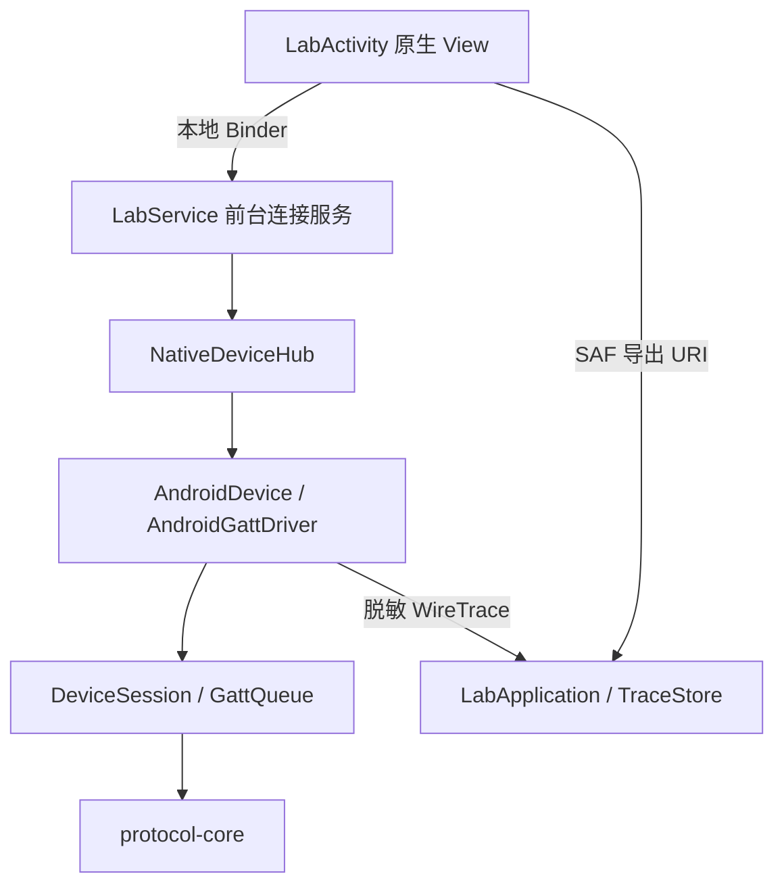

# OpenHOYI Lab

本轮是诊断宿主，不是最终产品首页。独立包 `io.openhoyi.lab`，可与 `com.hoyi.personal` 共存，不需要卸载旧App。

## 依赖和生命周期



图中箭头表示调用/数据流。编译依赖为 app → bluetooth-android → device-session → protocol-core。传输层实现纯Kotlin层定义的GattDriver端口，纯Kotlin层不知道Android。UI不拼协议字节，不持有Gatt。

LabService在用户扫描授权后从可见Activity启动，类型connectedDevice，通知持续显示。启动与权限次序依据[Android前台服务类型](https://developer.android.com/develop/background-work/services/fgs/service-types#connected-device)和[启动要求](https://developer.android.com/develop/background-work/services/fgs/launch)。Activity停止仅取消扫描/重连窗口；旋转保留窗口。已有连接由服务持有。START_NOT_STICKY，不在进程被杀后自动恢复控制。

日志由Application进程单实例持有；Service销毁/重建不创建并发写入队列。导出独立于BLE服务，文件选择过程中停止服务仍可完成导出，不会因此重新连接设备。

## 记录语义

- `wire.request`：准备调用Android API。
- `wire.accepted` / `wire.rejected`：API接受或拒绝；不是设备执行确认。
- `wire.completed`：匹配当前Gatt/代次/token的Android回调及status；仍不是萃取动作已完成证明。
- `wire.notification`：当前连接的原始通知，在解码前记录，包括未知/无效帧。
- `wire.disconnected` / `wire.close`：断开回调与本地关闭。
- `ui.*`、`state`、`diagnostic`：用户动作与会话状态；不记录密码、MAC地址。

COFFEE写端点01认证、0B改密整帧脱敏，含XOR。单帧最大记录512字节，超长标记截断。sessionId标识日志存储实例；ownerId标识Service实例；role/generation/token标识连接操作。seq、wallclockMs、monotonicNs保留记录顺序与时间。系统突然杀进程可能丢失队列尾部，不能保证崩溃日志全量持久化。

队列512项，满则丢日志并累计dropped；导出排队失败显式提示。最多8个4MiB文件，自动淘汰并计数。ZIP metadata统计属于当前存储实例；历史文件带各自sessionId。导出期间worker按顺序暂停后续写入；慢文件提供方可能导致队列满，metadata不是导出结束后全局最终统计。

## 待设备验证

最新结果见[实机报告](validation-2026-09-23.md)：咖啡机已认证并接收遥测；两次status=8断线待定位，秤及萃取未验证。

1. 安装独立APK，确认旧App仍存在且未被覆盖。页面无权限时显示未知数据，不应扫描或连接。
2. 拒绝/授权蓝牙权限，关闭/开启蓝牙，再扫描。拒绝通知权限也不应导致连接逻辑崩溃。
3. 暂时退出旧App对设备的连接，再手动选择咖啡机、输入密码；检查发现服务→订阅→认证→收到设置/遥测。
4. 选择BOOKOO，确认4条初始化写入有间隔且收到新样本后才Ready；用已知重量核对数值与正负号。
5. 旋转、切后台、锁屏、返回，检查服务存活和数据时效；断设备/撤权限不能继续显示“实时”。
6. 文件选择器打开期间停止服务，返回后ZIP必须成功或明确报错；停止/重启服务后的日志不能相互覆盖。
7. 导出并检查元数据、原始通知与脱敏；没有萃取、设置、校准、OTA入口。

诊断仪器测试（需空闲设备；若已授予权限且蓝牙开启，会扫描候选设备，但不选择/连接）：

```sh
adb install -r app/build/outputs/apk/debug/app-debug.apk
adb install -r -t app/build/outputs/apk/androidTest/debug/app-debug-androidTest.apk
adb shell am instrument -w io.openhoyi.lab.test/io.openhoyi.lab.LabSmokeInstrumentation
```

该测试覆盖未知数据、Activity重建、前后台服务保持和停止服务后的进程内ZIP导出；不验证真实BLE保持、物理旋转或SAF文件选择器。启动测试会重启Lab进程，若已有设备操作，先手动停止再执行。
