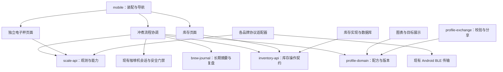

# HOYI 高级功能迭代调研报告

调研日期：2026-10-08。性质：规划建议，不是已批准的实现规格，不代表功能已开发。

代码核对基线：`c3710e3` 附近的当前工作区；基础版会话仍在更新。本报告不修改基础版实现、不改变现有设备控制许可。

## 1. 结论与版本边界

建议按 **“看清实时状态 → 记录并复现好喝的一杯 → 管理豆子 → 扩展设备与共享曲线”** 推进。优先解决图表与信息层级，不先建设云端社区，也不把口感预测作为交付条件。

“架构升级”是基础复刻版；高级迭代独立立项。基础版只收敛已定日常范围和阻塞使用的问题，高级需求不自动回填到它的完成条件。曲线编辑此前后置：现在分享自制曲线会依赖编辑能力，应在高级版重新排期，而不是悄悄扩大基础版。

三种路线比较：

| 路线 | 得失 | 建议 |
|---|---|---|
| 体验优先、离线优先、模块逐步解耦 | 最快看到图表、选曲线和复盘改善；接口随真实需求形成 | **推荐** |
| 先做大而全的插件平台，再做体验 | 扩展空间大，但容易继续陷入架构和边界加固 | 不推荐作为第一轮 |
| 先做云端账号、曲线社区和智能推荐 | 分享便利，但引入服务端、同步和运营工作；不解决当前首要痛点 | 后续有明确需求再做 |

默认按 Android 原生、手机/平板响应式、单人离线使用规划；不默认增加账号、云同步、订阅或 AI 服务。

## 2. 当前基础与隐藏依赖

| 当前事实 | 对高级迭代的影响 |
|---|---|
| 已有 `protocol-core`、`device-session`、`bluetooth-android`、`mobile`、`trace-core` | 可以增量扩展，不需要再重写整个架构 |
| 真实秤链路目前只有 BOOKOO；其它型号是部分离线候选解析 | “能解析重量”不等于“完整支持该秤”；发现、订阅、心跳、去皮及重连需逐型号验证 |
| 已有原生 View/Canvas 图表与曲线分段示意；实际图表已支持空值断线、各系列独立缩放 | 重点是改图表语义、分图与状态层级，不是从零建设绘制；不能直接把阶段序号改成秒数 |
| 历史已有稳定曲线关联和每杯 ID；暂无完整豆子、粉量、研磨和复盘模型 | 可关联新增记录，但需要新数据模型和兼容迁移 |
| 当前本机历史限制为 30 天/500 条 | 长期笔记和累计次数不能依赖这份短期列表即时统计 |
| 导入曲线现在只读，曲线完整编辑未做 | 自制曲线分享需要编辑、版本化和导入执行资格这组配套功能 |
| 部分日常控制有实机证据，完整重量停止、生命周期等仍未验收 | 新 UI 不可绕过原控制门禁；设备扩展完成时间依赖样机 |

依据：[当前架构](../architecture.md)、[原生功能状态](../native-feature-status.md)、[功能对标审计](../native-parity-audit.md)、[当前 UI 规则](../ui/native-redesign.md)。这些是代码/文档现状，不是本报告中的新增设计。

## 3. 设计依据与产品参照

以下提炼自官方指南和产品自述；未做这些 App 的完整交互实测，不将营销说明当作 HOYI 的设备能力证明。

| 来源 | 已核对的依据 | 本项目如何采用 |
|---|---|---|
| [Material Design 3](https://m3.material.io/foundations/overview/principles) | 默认可访问性、可定制体验 | Android 交互习惯和统一组件为基础；常用状态无需学习特殊手势 |
| [Android 自适应导航](https://developer.android.com/design/ui/mobile/guides/layout-and-content/layout-and-nav-patterns) | 不同宽度可采用底部导航、侧栏和多栏布局 | 手机单列；平板列表/详情并列，萃取图表获得更大空间 |
| [Apple HIG Charts](https://developer.apple.com/design/human-interface-guidelines/charts) | 数据优先于网格和装饰；关键信息不能依靠交互才出现；颜色需有替代标识 | 读数与状态始终可见；标签、单位、线型共用；不照搬 iOS 控件或视觉材质 |
| [Ant Design 数据可视化页](https://ant-design.antgroup.com/docs/spec/visualization-page-cn) | 概览、聚焦、按需详情；最重要指标优先 | 实时页突出状态和数据，不照搬企业大屏；说明和低频操作按需展开 |
| [Decent 官方快速指南](https://decentespresso.com/doc/quickstart/quickstart.pdf) | 已使用虚线目标、实线实际的对照方式 | 目标/实际的视觉语义有先例；HOYI 必须另外核对阶段和目标定义 |
| [Beanconqueror 官方项目](https://github.com/graphefruit/Beanconqueror) | 豆子、研磨/粉量、评分、多型号秤和实时记录形成一体工作流 | 借鉴“记录让下一杯可复现”，不默认把全部字段强塞给用户 |
| [Visualizer](https://visualizer.coffee/) | 曲线、元数据、笔记、对照与分享关联 | 优先关联同豆、同曲线的历史参考；云端社区不是本轮前置条件 |

具体 Android 触控区域建议至少 48×48dp，停止按钮应更容易触达。依据：[Android 可访问性指南](https://developer.android.com/guide/topics/ui/accessibility/views/apps-views)。

## 4. 需求总表

难度：1=低、2=较低、3=中、4=高、5=研究型。包含模型、UI 和必要验证，不只算编码。

P0=第一轮体验核心；P1=随后高价值功能；P2=配套成熟后交付；P3=探索，不挡住版本。优先级是本报告建议，尚未由用户最终确认。

| ID | 需求 | 实现可行性 | 难度 | 建议方案 | 优先级 |
|---|---|---|---|---|---|
| A1 | 秤抽象与多协议适配 | 高；每个型号需独立验证 | 4 | 能力接口＋协议适配器；先迁移 BOOKOO，再逐型号接入 | P1；第一轮冻结契约即可 |
| A2 | 独立电子秤页面与联动 | 高 | 3 | 重量、流速、计时、去皮、连接状态；独立于咖啡机使用 | P1 |
| A3 | 实时萃取图表与状态重设计 | 高；原始数据已有 | 4 | 数字概览＋阶段＋同时间轴分图＋固定停止 | **P0，首要** |
| A4 | 预设目标与实际走势对照 | 条件可行；不是完整结果预测 | 4 | 当前阶段目标先行；确定性目标线、历史参考线分开 | P2；短期研究验证 |
| A5 | 预设曲线选择与预览 | 高 | 3 | 曲线卡片、阶段结构、目标摘要、历史线及可用状态 | P0 |
| A6 | 每杯个人复盘 | 高 | 3 | 自动记录＋可选豆子/粉量/研磨＋主观感受和下次计划 | P1 |
| A7 | 曲线按使用次数/最近使用排序 | 高 | 2 | 永久使用事件账本，稳定 ID 与明确统计口径 | P0，随选曲线交付 |
| A8 | 独立咖啡豆库存模块 | 高 | 3 | 豆款、批次、库存流水、查询/调整 API；离线存储 | P1 |
| A9 | 选豆、粉量与自动扣库存 | 高；跨模块一致性需设计 | 4 | 投粉确认产生幂等消耗记录；失败补偿而非重复扣减 | P1，依赖 A6/A8 |
| A10 | 自制曲线分享与复制导入 | 高；执行资格是额外前置条件 | 4 | 版本化文本/文件分享、预览、校验、保存；最小编辑能力配套 | P2 |
| A11 | 全局 UI 简化与聚焦 | 高 | 4 | 重整任务流和页面层级，建立设计组件；分批替换页面 | P0 设计框架，后续逐页落实 |
| R1 | 最终口感/实际结果预测 | 暂不能承诺；需数据和验证 | 5 | 先积累豆子、研磨、曲线、实测与评分，不做自动调机 | P3，可不做 |

## 5. 逐项方案、限制与验收

### A1. 电子秤抽象层及更多型号

**可行，难点是设备差异，不是定义一个通用接口。** BOOKOO 官方已公开 MINI SCALE 的 GATT 服务、重量通知和去皮命令，说明部分品牌可按公开协议接入。[BOOKOO 官方协议](https://github.com/BooKooCode/OpenSource/blob/main/bookoo_mini_scale/protocols.md)。其它品牌可参考开放项目，但不能把参考代码当作跨固件兼容保证。

建议三层：`scale-api` 定义观测和操作契约，`scale-adapters` 负责具体协议，现有 Android BLE 层提供传输。初期可用静态注册适配器，不做动态下载插件。

统一观测应包含：重量及单位、设备/主机时间、采样质量、新鲜度、连接身份；流速标明是设备报告还是由重量差分估算。不要把缺少的数据补成 0。统一能力应区分：重量、去皮、设备计时、电量、模式切换、设备流速；UI 只展示实际支持能力。

去皮区分“支持写入”与“能确认结果”；不支持设备计时时用 App 本地计时，并明确来源。适配器返回结构化结果，不吞掉未知执行状态。咖啡机控制只消费统一重量观测和能力，不读取品牌字段。

先让 BOOKOO 经过新接口且行为不变，再按用户拥有设备/协议公开程度选第二个具体型号。Acaia、Felicita、DiFluid 是候选，不预先承诺全系列兼容。

**验收：** 咖啡机与页面无品牌分支；新增第二适配器无需改萃取业务；型号测试覆盖初始化、负重、单位、乱序/过期数据、去皮与重连；重量停水必须另做实机验收。

### A2. 专门的电子秤页面

**可行，建议成为独立工具，而不是咖啡机设置的子菜单。** 未连接咖啡机也能称重、去皮和计时；未来可以用于称豆、手冲，但不把复杂手冲配方塞入首版。

首屏：大号重量、数据是否实时、计时器、去皮按钮；次级区域：流速图、设备电量（如支持）、连接管理。提供“把本次稳定重量作为粉量”的显式动作，不能自动把杯中液重当作粉量。

与萃取页共享同一个秤会话，不另开第二条连接；活动萃取期间页面仍可查看，去皮沿原规则禁用，不允许切换设备破坏重量停止链路。计时来源和联动规则由协调层管理，不由两个页面各自启停。

**验收：** 无咖啡机可用；切页不重复连接；过期值不伪装实时；不支持功能有清楚状态；称豆录入与杯重采样不混用。

### A3. 实时萃取页：图表与状态第一

**这是首轮最高优先级。** 页面第一眼应回答：“机器正在做什么、出了多少液、当前压力和流速是多少、数据是否可靠、怎么停止”。图表服务这些问题，不是展示所有传感器。

推荐信息结构，图中为布局示意，不是设计定稿或真实数据：

```text
┌──────────────────────────────────────────┐
│ Hyper Ex · 正在萃取         设备数据实时    │
│ 24.6 s       28.4 / 36 g       1:1.58     │
│ 8.2 bar      1.6 g/s           93 °C      │
├──────────────────────────────────────────┤
│ 压力 bar     [实际实线 / 目标虚线*]        │
│            随时间变化的主图               │
├──────────────────────────────────────────┤
│ 杯中流速 g/s    第二张图；时间轴与主图对齐  │
│ 预浸 │ 主萃取 │ 收尾*                     │
├──────────────────────────────────────────┤
│             [ 停止萃取 ]                  │
└──────────────────────────────────────────┘
* 仅在阶段/目标有可靠定义时显示，不猜测。
```

粉液比只在确认粉量且杯重有效时显示。称豆粉量和萃取杯重必须有清楚的归零/容器上下文，否则仍显示秤读数而不是宣称最终液重。

图表规则：

- 默认两张共享时间轴的图；不要把 bar、g、°C、mL/s、g/s 五种单位挤在同一纵轴。压力为主，杯中流速为辅；重量优先大号读数，温度优先数值，可在详情切换查看。
- 机器水流和杯中流速不同：保留独立名称、来源和单位。未校准的设备流速不能用于目标误差评分。
- 实线=实际、虚线=目标、细灰线=某杯历史参考；用文字和线型补足颜色，不只靠颜色识别。
- 本杯内纵轴尽量稳定；超范围时扩展并保留值，不裁掉异常峰值。时间轴按明确窗口扩展，阶段转换和刻度不能抖动。
- 掉线或缺采样显示断点和最后更新时间，不把空缺平滑成连续正常曲线。异常样本保留在原始记录，显示过滤与控制数据分开。
- 默认追踪当前时刻；查看过去只改变显示，停止入口始终固定。暂停图表不等于停止机器。
- BLE/记录接收和 UI 绘制解耦；当前页面约 4Hz 刷新，先保留并测量，必要时在约 4–10Hz 范围比较体验与功耗，原始采样不因绘制降频丢失；不要未测试就提高频率。

刷新间隔可影响旧设备体验，Beanconqueror 官方也提供图表刷新间隔调整。[官方蓝牙功能说明](https://beanconqueror.com/blog/bluetooth-device-features/)。本项目默认自动合理节流，不让用户先理解毫秒参数才能使用。

当前实现有一个应先核对的具体单位缺口：`ExtractionActivity` 把 `deviceFlowHundredths` 标为 `g/s`，但导出说明仍明确其物理单位待校准。不能继续基于这个标签计算偏差；证据不足时展示“设备流速（单位待确认）”，或另用重量差分生成明确标注的估算质量流速。差分必须处理负重量、移杯、去皮和采样间隔，不能替换控制层原始重量。

**验收：** 用户无需打开详情就能识别状态和关键读数；窄屏、横屏、大字体、深浅色均不遮挡停止；断链、过期、未知结果可辨识；长杯渲染不堵塞控制；用少量真实用户做约 3 秒状态识别测试，记录正确率和误读原因。

### A4 / R1. “预期效果”能做到哪一步

| 层次 | 可行性与价值 | 方案及边界 |
|---|---|---|
| 当前阶段与设定目标 | 高，能解释机器当前应该做什么 | 解析阶段参数，与机器回报或可靠阶段识别关联 |
| 完整目标时间走势 | 条件可行，便于判断跟踪效果 | 仅对固定时长且语义清楚的阶段生成；斜坡/插值方式必须核实，不能猜 |
| 实际与目标对照 | 条件可行，适合复盘 | 对齐时间、阶段、测量点和单位；先描述偏差，不给“好喝分数” |
| 某杯好喝历史作为参考 | 高，通常更贴近实际使用 | 用户选参考杯；明确是历史实测，不是机器目标 |
| 提前预测完整实际压力、液重、流速 | 低到中，需要模型与真实样本 | 粉饼状态和机器响应使目标不等于实际；初期不做精确承诺 |
| 预测酸甜苦/香气等口感 | 当前证据不足 | 积累可关联评分数据再评估；只靠曲线不足以可靠预测 |

Decent 官方明确支持按时间、压力或流量条件切换阶段。因此即便其它设备存在目标线，也不能推出任意曲线都有确定的未来时间轴。[Decent profiling](https://decentespresso.com/profiling)。当前 HOYI 预览本身是分段示意，须核对其真实字段与固件行为。

更具体的代码限制：当前 HOYI 启动模型最多四段，只有第一段显式时长；工厂目录保存的是 `segmentFlowMl` 分段水量，并校验分段和等于总水量。这组字段即便在线格式中被命名为 `FlowTenths`，也不能直接解释为 mL/s。当前没有完整阶段时间边界或闭环模型，因此**现在不能仅凭预设生成可信的完整压力/流速时间目标线**。可确定参数示意、最终重量目标和历史参考是更稳妥的第一步。

建议先做小型只读验证：挑 3 类代表性预设，建立 `TargetProfile`，记录每段控制量、时间/条件、不确定区间；对照已有真实采样及新实杯。固定时间段可展示时间线；条件结束段显示阶段目标，未来区间标为未定；信息不足时退回分段结构，不伪造时间目标。

机器目标水流与杯中质量流速不可直接对照；压力模式下的流量可能是限制条件而非必达目标，反之亦然。没有同语义目标就不画差值。重量只有终点目标时显示目标线/数字，不凭空构造整条重量曲线。

**验收：** 每条虚线能追溯到预设字段或明确参考杯；条件结束阶段不伪装定时；不支持曲线有清楚降级；不发送动态调机命令。若识别测试表明用户更易误读，就不将目标叠线设为默认。

### A5. 预设曲线选择与直观预览

**可行，建议从“曲线名称目录”改成“能理解的配方卡片”。** 每张卡显示名称、控制方式、阶段结构、设定温度、终点方式/目标、使用次数和最近使用。能可靠说明时才给简短特点，不凭曲线名自动推断适合什么豆或最终风味。

统一缩略图比例和图例。明确区分“阶段结构图”“可确定目标时间图”“历史实测图”，不能在同一区域无标识替换。压力/流量目标分开；详情展示阶段参数，窄屏列表进详情，平板双栏。

默认提供最近使用；用户可切换常用、分类或搜索，记住排序偏好。选中曲线只更改选择，不发送蓝牙。查看导入曲线和执行资格分开呈现，避免“能看到就能启动”的误解。

**验收：** 用户能在选择前说出控制方式和阶段特点；列表与详情一致；空状态、同名曲线、不可执行曲线可区分；点击选择不会启动机器。

### A6. 每杯复盘与下一次调整

**可行，不应做成长表单。** 萃取数据自动填，用户信息分为轻量复盘与可展开详情。字段均可空，不强迫每杯填写。

建议记录：豆款/批次快照、粉量 g、磨豆机和研磨刻度（支持文本，避免只接受数字）、本次曲线 ID/版本/参数快照、实际遥测摘要、用户对曲线跟踪的评价、酸甜苦/醇厚等可选感受、自由笔记、下次调整计划。

机器跟踪评价与主观满意度分开：跟踪准确不代表好喝。下一杯可带入豆子、粉量、研磨和计划，但需要用户确认；不自动把笔记改成机器控制参数。

记录完成后即可轻量编辑，未尝咖啡时允许稍后补。保存草稿应能跨页面/重启恢复。曲线改名、豆子归档后，旧杯快照不改变。

长期摘要和笔记不沿用 30 天/500 条淘汰规则；高频原始采样可独立按容量保留，删除前说明影响。已缺失的旧记录不能重建成虚假历史。

**验收：** 空字段、未知结果杯和中途取消均可记录；字段不被刷新覆盖；下一杯可复用但不自动控制；长期笔记不会因采样清理消失。

### A7. 按次数与最近使用排序

**可行，工作量较小，但统计口径必须先明确。** 用稳定 `curveId` 聚合，同一曲线版本升级保持谱系，修改后的具体版本另有 `revisionId`。名称不是主键。

建议“使用”=观察到真实萃取开始，每个 `shotId` 计一次；仅选择、浏览、预热、失败且未开阀不计。未知结果杯只要已观察开始仍计，另有结果标签。手动萃取没有可信曲线关联时不硬算到当前选择。显示和统计区分 Mock 与真实记录。

独立持久化使用事件/统计，不能只在当前 500 条里算。排序提供次数倒序、最近使用倒序；并列时用固定名称/ID 规则；没有使用记录排后，不造成列表每次打开跳动。

旧记录只回填可证明的使用，标注旧历史覆盖范围；用户主动删除一杯时同步更新对应统计，普通采样保留清理不重置累计次数。

**验收：** 重建、重复结束回调不重复计数；失去原始采样后累计仍在；改名不归零；两种排序与定义吻合。

### A8. 独立咖啡豆库存

**可行，独立是领域和接口独立，不要求立刻拆成服务端或第二个 App。** `bean-inventory` 自己管理数据和界面，可以在没有咖啡机、没有蓝牙权限时正常使用。

最小模型：豆款、批次/袋、购买/烘焙/开封日期（可选）、初始重量、库存流水。把同一豆款不同烘焙批次分开，避免全部合成一条剩余数字。

库存变化通过入库、消耗、调整、冲正流水表达；重量以整数 mg 存储，界面以 g 输入/显示，避免反复浮点扣减。耗尽归档而不删除被历史引用的数据。首版可选低库存标记，不扩成采购系统。

消费者只用 `InventoryRepository` 或独立 API，不能直接访问表/DAO；咖啡机、BLE、曲线实现都不能成为库存模块依赖。可采用 Room，本地数据库细节由实现层隐藏。[Android 模块化指南](https://developer.android.com/topic/modularization/patterns)、[Room 官方指南](https://developer.android.com/training/data-storage/room)。

**验收：** 独立录入/查询/消耗/调整/归档；断网可用；批次清楚；归档不破坏旧杯；有备份恢复和 schema 迁移方案。

### A9. 选豆、用量与自动扣库存

**可行，核心不是减法，而是“何时豆子真的被消耗”。** 粉量不是杯中液重，也不是曲线目标重量。

建议流程：选择豆子和计划粉量 → 称豆或手动确认实际投粉 → 产生唯一 `consumptionId` → 自动扣库存 → 后续萃取记录关联消耗。普通开始流程可合并一次投粉确认；仅浏览、选曲线、预热不扣。没有关联豆子时仍可萃取，不做猜测扣减。

启动失败、提前停止或咖啡不好喝，不意味着粉已回到袋里；已确认投粉不自动退款。用户可显式改实际用量/冲正。库存不足要提示并允许核对/修正库存；不允许静默负库存，更不能因为库存问题挡住正在运行的停止操作。

若库存和日志是两个存储，不能假装一次数据库事务能包住两边：协调层持久化待处理事件，库存侧按 `consumptionId` 幂等扣减，确认后更新日志关联；崩溃恢复只重放本地事件，不重发机器启动。若共享物理数据库仍要隐藏库存 DAO，避免为了事务耦合领域。

**验收：** 重复点击和进程重启只扣一次；离线可用；数量修改按差额/冲正处理；失败杯不自动回库；库存与日志异常时能显示待同步状态并恢复。

### A10. 自制曲线分享与复制导入

**可行，建议首版不建社区。** 支持系统分享 JSON 文件和短文本；接收方主动粘贴或打开文件，先看预览再保存。较大曲线用文件，不把完整内容硬塞二维码；不静默读取剪贴板。

格式应包含 `schemaVersion`、来源、曲线 UUID/版本、名称、控制方式、阶段字段、单位、目标/结束条件和兼容元数据。分享结构化参数，不分享任意 opcode、设备地址、密码、个人笔记或库存数据。校验摘要可检测传输损坏，不能当作作者可信认证。

同 ID 同版本去重；同名不同曲线允许并存；导入保存本地身份和来源，不能覆盖已有工厂曲线。未知 schema、非法范围、缺字段、过大文件给出具体拒绝理由。

依赖：最小曲线编辑/复制/版本化。第一阶段可以分享现有已定义配方，并将外来曲线只读保存；但这不算完成“自制曲线可直接使用”。完整功能必须支持用户创建/修改，经过受支持的参数化编码器、语义验证和设备兼容检查后才进入可选执行列表。

“导入成功”和“能在当前机器运行”分开：固件/控制方式不支持时可保存查看，但不启动。不能因为文件声称“已验证”就绕过本机检查。既有只读导入路径可复用，但它目前不提供执行资格。

当前还有具体实现前置：`CurveLibrary`/`FactoryWireProof`/`DeviceSession` 采用固定已验证曲线与启动帧许可。任意编辑后的新曲线不会自动获准执行。M4 必须单独设计并验证受限参数化曲线的许可机制，保留已有固件、范围、状态和发送前检查；不能用“导入文件通过 JSON 校验”替代这项工作。若无法取得必要设备证据，分享/编辑可先只读交付，但完整自制曲线交换仍标为未完成。

**验收：** A 创建并分享，B 粘贴后得到相同阶段参数且可预览；同版本不重复导入；不泄露个人字段；非法文件不发送命令；至少有受支持自制曲线在兼容设备的完整运行验证。

### A11. 全局 UI 重设计

**可行，建议先改信息架构，再改视觉。** 当前项目已做过 UI 调整，因此本轮不是“第一次做原生设计”，而是把高级模块加入后重新聚焦任务流。

建议顶层为“冲煮、曲线、记录、豆子”，电子秤在冲煮工具/设备入口中有独立页面，设置收至次级入口；后续独立秤使用成为主需求再评估第五个主入口。库存模块独立不等于必须占一个固定技术模块式导航。

准备态：选曲线、选豆/粉量、确认设备、开始；萃取态：切入专注界面，状态与图表优先，减少设置入口，但不剥夺必要退出/返回；结束态：摘要和可跳过复盘。高级参数渐进展开。状态文案描述发生了什么和可做什么，不把协议类名展示给用户。

保留 Android 平台习惯；借鉴 Apple 的层级和图表原则，不混搭两套控件。统一字体尺度、间距、状态颜色、图表语义和反馈组件。手机与平板响应式，避免只把同一长列表拉宽。

技术路线优先复用现有原生 View/Canvas 和共享组件；若用 Compose，作为局部实现选择比较维护成本，不把整站迁移框架当成 UI 重设计的前置条件。

**验收：** 从连接/选曲线到开始的路径清楚；低频维护不占实时页；停止无需滚动或先关弹窗；每种状态对应明确界面；真实用户能完成选曲线、看状态、停机、复盘、找上次好喝记录。

## 6. 模块边界建议

以下是建议依赖，非当前已有模块清单。先定义小接口，再按代码规模决定是否拆独立 Gradle 模块。



箭头表示依赖，不表示命令数据流。接口和实现由 App 注入；库存不依赖冲煮，适配器不依赖页面，图表不发送命令。长期摘要/笔记与高频遥测保留分离；曲线参数快照确保修改后旧记录仍可解释。

## 7. 建议迭代顺序与工作量

估算是调研阶段的低置信区间：熟悉项目的单名 Android 开发者、复用现有代码、离线首版，无账号/服务端；包含必要验证，不含等样机、用户反馈和旧版真实数据的时间。不是自动执行承诺或日历截止日期。

| 里程碑 | 交付内容 | 有效工作量估算 | 完成条件 |
|---|---|---|---|
| M0 范围与设计冻结 | 页面任务流、图表语义、核心数据模型、目标线短研究 | 3–5 人日 | 明确 A3/A5 首屏与未做项；不顺带大改架构 |
| M1 看得清、选得快 | A3/A5/A7、A11 首轮组件与导航；永久使用事件基础 | 10–16 人日 | 可用新实时页和曲线选择；排序正确；渲染/状态验收 |
| M2 记住并管理每杯 | A6/A8/A9，长期日志、库存、粉量确认及扣减 | 10–16 人日 | 选豆→用量→扣库存→复盘→下一杯复用完整闭环 |
| M3 独立秤工具与扩展 | A1/A2，BOOKOO 迁移及一个新增具体型号 | 8–13 人日＋设备等待 | 两型号通过契约/实机矩阵，秤独立使用成立 |
| M4 自制曲线可交换 | 最小编辑、版本化、A10、导入运行资格 | 10–16 人日＋设备等待 | 两端分享/导入/预览/兼容执行验证 |
| M5 可选目标对照 | A4 根据 M0 结果做阶段目标/确定性目标线/历史参考 | 4–8 人日 | 可追溯目标、不误导、明确降级；无价值可不做 |

M0–M4 合计约 **41–66 有效人日**，约 8–13 个五日工作周，尚未计外部等待。M1 就应独立交付体验改善，不等后续全部完成。实际排期应在 M0 设计冻结和设备可用性确认后修订。若只做 M0–M2，约 23–37 人日，先交付最有感知的图表、复盘和库存闭环。

A1 契约与日志/曲线 ID 约定在 M0 明确，避免 M1 重做；多品牌协议实现不必先于图表。M3/M4 可根据拥有的设备和自制曲线需求互换顺序。R1 不纳入估算。

## 8. 防止再次偏离交付

- 每个里程碑必须交付用户可操作的完整路径，不以类迁移数量、测试断言数量或 CI 轮数充当进度。
- 新发现的问题分阻塞和非阻塞：误发控制、停止失效、数据丢失、主要路径崩溃属于阻塞；其它进入后续清单，不自动扩大当前版本。
- 验证围绕变化和明确失败：图表验证单位/缺口/渲染，库存验证幂等/恢复，适配器验证协议契约。通过后不无理由反复扩展无关矩阵。
- UI 与数据功能可先以回放/Mock 交付预览；新设备控制仍需真机。不混淆“视觉验证通过”和“物理执行正确”。
- 完成状态使用“已实现、已软件验证、已实机验收、被何条件阻塞”，同时列出当前里程碑剩余项。

## 9. 证据与尚未解决的判断

已解决：整体路线、每项初步可行性/难度/方案/优先级；官方设计原则、同类产品功能先例；现有架构、历史保留和曲线示意的限制。

仍需后续实施前明确，不影响本次调研报告完成：第二个具体秤型号；HOYI 各类阶段/插值与物理流量单位；长期原始采样保留策略；真实数据迁移样本；图表原型的用户识别测试；基础版日常功能验收范围。未解决这些问题前，不把估算升级为固定发布日期。

### 资料使用说明

报告链接均指向官方设计文档、厂商协议或产品/项目自述。Apple 和 Material 的 JS 页面通过浏览器读取工具取得正文，搜索工具的静态页面空壳未作为正文证据。未复制第三方实现代码。曲线控制、库存一致性、优先级和工期均为基于现有代码的方案建议，不是来源直接给出的结论。

## 10. 关键代码证据索引

以下行号用于复核本次调研事实，后续代码更新可能移动。没有运行设备测试；这里的证据是当前实现边界。

| 判断 | 入口 |
|---|---|
| 角色及真实 BOOKOO 分支硬编码 | [DeviceSession.kt](../../device-session/src/main/kotlin/io/openhoyi/session/DeviceSession.kt:6)、[NativeDeviceHub.kt](../../bluetooth-android/src/main/kotlin/io/openhoyi/bluetooth/NativeDeviceHub.kt:35) |
| 现有秤契约无能力协商 | [ExtractionController.kt](../../device-session/src/main/kotlin/io/openhoyi/session/ExtractionController.kt:18) |
| 其它秤只有候选解析 | [LegacyScaleCandidates.kt](../../protocol-core/src/main/kotlin/io/openhoyi/protocol/LegacyScaleCandidates.kt:3) |
| 四段模型与工厂分段水量 | [CoffeeCommands.kt](../../protocol-core/src/main/kotlin/io/openhoyi/protocol/CoffeeCommands.kt:6)、[FactoryCurveCatalog.kt](../../mobile/src/main/kotlin/io/openhoyi/mobile/FactoryCurveCatalog.kt:7) |
| 预览是等距阶段示意 | [CurveStageView.kt](../../mobile/src/main/kotlin/io/openhoyi/mobile/CurveStageView.kt:10) |
| 自绘图表、空值断点及整数单位转换 | [ShotChartView.kt](../../mobile/src/main/kotlin/io/openhoyi/mobile/ShotChartView.kt:14) |
| 当前 250ms 刷新和流速显示标签 | [ExtractionActivity.kt](../../mobile/src/main/kotlin/io/openhoyi/mobile/ExtractionActivity.kt:67)、[流速显示](../../mobile/src/main/kotlin/io/openhoyi/mobile/ExtractionActivity.kt:340) |
| READY/1500ms 新鲜度与到达时间采样轴 | [LiveTelemetry.kt](../../mobile/src/main/kotlin/io/openhoyi/mobile/LiveTelemetry.kt:10)、[ShotSeries.kt](../../mobile/src/main/kotlin/io/openhoyi/mobile/ShotSeries.kt:42) |
| 秤设备流速单位仍待校准 | [ShotHistoryArchive.kt](../../mobile/src/main/kotlin/io/openhoyi/mobile/ShotHistoryArchive.kt:17) |
| UUID、curveId、缺少复盘字段及 30 天/500 条保留 | [ShotHistory.kt](../../mobile/src/main/kotlin/io/openhoyi/mobile/ShotHistory.kt:18)、[保留策略](../../mobile/src/main/kotlin/io/openhoyi/mobile/ShotHistory.kt:100) |

对接时必须明确时间轴：当前采样用本机单调时钟的通知到达时间，不是机器 `elapsedSeconds`；机器点拼接最近 1500ms 内的秤数据。做目标误差或两杯对照前，需要确定对齐策略并显示不确定性。现有采样最多 2000 点，满后减半并提高采样间隔；显示降采样和统计所用数据也必须区分。


## 2026-10-10 协议来源补核（不代表实机兼容）

- Acaia 官方 Android SDK 固定来源为 [8dc977e](https://github.com/acaia/acaia_sdk_android/tree/8dc977e8123eb5e13b5370b3f357e6af082c79e0)。README 列出 Pearl/Lunar/Pearl S/Cinco/Pyxis、重量通知、去皮和计时；协议实现以 AAR 提供，不是公开 GATT 源码。[许可证](https://github.com/acaia/acaia_sdk_android/blob/8dc977e8123eb5e13b5370b3f357e6af082c79e0/LICENSE)允许按其条款使用未修改二进制，禁止逆向。架构判断：直接加入其扫描/连接管理不能证明与现有唯一 BLE owner 相容，因此本轮不直接引入该 SDK，不通过逆向取得协议，不触发向厂商发送消息。
- Felicita 公开证据固定到 Beanconqueror [b975d393](https://github.com/graphefruit/Beanconqueror/tree/b975d39319588c80b47f0531b207e00df55c8743)。[作者说明](https://github.com/graphefruit/Beanconqueror/blob/b975d39319588c80b47f0531b207e00df55c8743/src/classes/devices/felicita/felicita-readme.md)给出18字节通知样本：第3到8索引为六位ASCII数字，按百分之一克；9到10为单位；15为电量范围129..158。索引2的正负符号、首尾形态需要显式识别，不能将任意18字节都视作克重。[常量](https://github.com/graphefruit/Beanconqueror/blob/b975d39319588c80b47f0531b207e00df55c8743/src/classes/devices/felicita/constants.ts)给出FFE0/FFE1，但来源不是厂商全型号协议或本项目设备验收。
- 原旧拆包 Felicita 候选按头两个字节转换重量，不能用来声称支持上述完整通知；公开样本会被误读为2.58g而非0g。新增真实帧形态的独立离线解析和回归，未知单位不标作克重，负重不丢符号，电量越界不伪造。保持OFFLINE_CANDIDATE，不授予连接、去皮或重量停水资格。完整第二型号连接仍需具体型号、固件与可验证设备证据。
